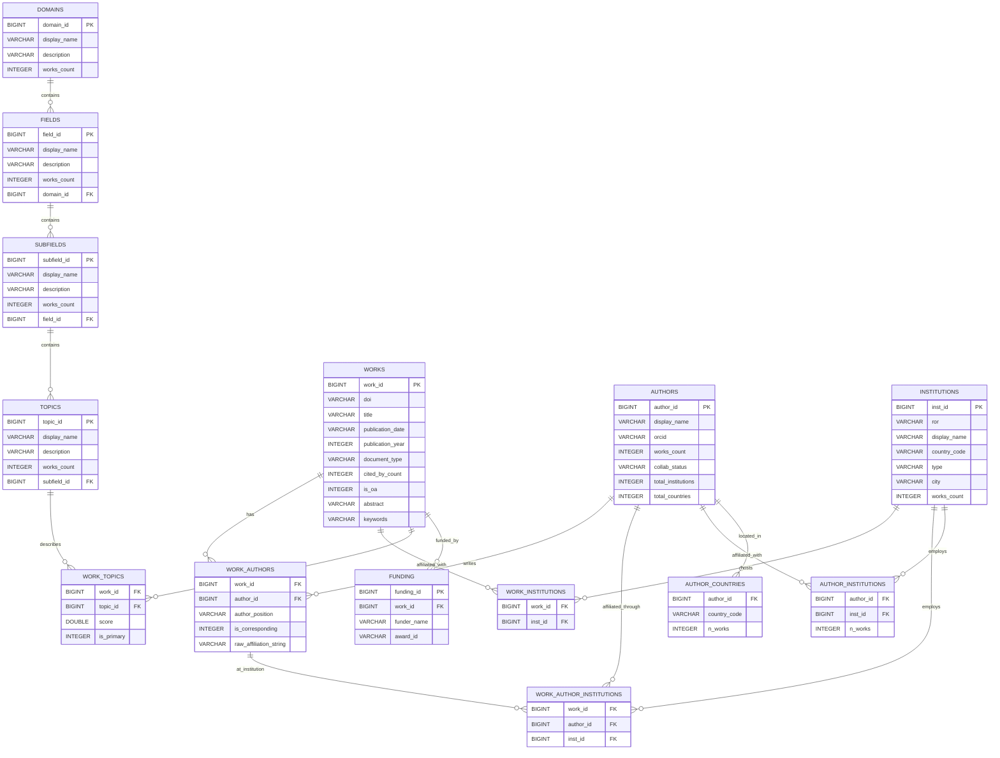

# Indo-Swiss Research Collaboration DuckDB Database Documentation

## Database Overview

### System Information
- **Database Engine**: DuckDB v1.0+
- **File Path**: `indo_swiss_research.duckdb`
- **Database Size**: 2.07 GB (uncompressed)
- **Compressed Size**: 447 MB (gzip level 9)
- **Creation Script**: `data_assembly/create_DuckDB.R`
- **Last Updated**: Check `update_log` table
- **Primary Use Case**: High-performance analytical queries on Indo-Swiss research collaboration data

### Key Features
DuckDB provides:
- **Columnar storage** for faster analytical queries
- **Native Parquet integration** for efficient data loading
- **Parallel query execution** capabilities
- **In-process analytical database** (no separate server needed)
- **SQL-92 compatible** with extensions for analytics

### Data Sources
- **Primary**: OpenAlex database (publications, authors, institutions)
- **Topics Hierarchy**: OpenAlex topics SQLite database (domains, fields, subfields, topics)
- **Enhanced Metadata**: Web of Science and Scopus (keywords, abstracts)
- **Date Range**: 2000-2024
- **Geographic Focus**: India-Switzerland research collaborations

---

## Database Statistics

### Table Record Counts
| Table | Records | Description |
|-------|---------|-------------|
| works | 24,900 | Research publications |
| authors | 556,125 | Unique researchers |
| institutions | 22,655 | Research organizations |
| work_authors | 5,344,540 | Author-publication links |
| work_institutions | 721,034 | Institution-publication links |
| work_topics | 69,627 | Topic-publication links |
| domains | 4 | Top-level research areas |
| fields | 26 | Research fields |
| subfields | 252 | Research subfields |
| topics | 4,516 | Specific research topics |

### Relationship Cardinality
- **Authors per work**: Average 215.9, Maximum 5,244
- **Institutions per work**: Average 30.0, Maximum 1,352
- **Works per author**: Average 9.6, Maximum 1,716
- **Topics per work**: Average 2.9, Maximum 3

### Data Quality Metrics
- **Abstract Coverage**: 91.8% (22,862/24,900)
- **DOI Coverage**: 97.8% (24,350/24,900)
- **ORCID Coverage**: 34.6% (192,663/556,125)

### Collaboration Distribution
| Status | Authors | Percentage | Description |
|--------|---------|------------|-------------|
| None | 466,823 | 83.9% | Neither Indian nor Swiss affiliations |
| CH | 53,290 | 9.6% | Only Swiss affiliations |
| IN | 28,404 | 5.1% | Only Indian affiliations |
| Joint | 5,886 | 1.1% | India-Switzerland collaboration |
| Both | 1,722 | 0.3% | Both countries (different publications) |

### Top Research Domains (Indo-Swiss)
1. **Physical Sciences**: 10,155 works
2. **Health Sciences**: 7,398 works
3. **Life Sciences**: 4,034 works
4. **Social Sciences**: 2,635 works

---

## Entity Relationship Diagram



---

## Database Schema Details

### Core Entity Tables

#### 1. **works** (Publications)
Primary table containing research publications.

| Column | Type | Description | Constraints |
|--------|------|-------------|-------------|
| work_id | BIGINT | OpenAlex work ID (W prefix removed) | PRIMARY KEY |
| doi | VARCHAR | Digital Object Identifier | |
| title | VARCHAR | Publication title | |
| publication_date | VARCHAR | Full publication date | |
| publication_year | INTEGER | Year of publication | INDEX |
| document_type | VARCHAR | Type of document | |
| cited_by_count | INTEGER | Citation count | INDEX |
| is_oa | INTEGER | Open access status (0/1) | |
| source_display_name | VARCHAR | Journal/source name | |
| abstract | VARCHAR | Publication abstract | |
| language | VARCHAR | Publication language | |
| volume | VARCHAR | Journal volume | |
| issue | VARCHAR | Journal issue | |
| first_page | VARCHAR | Starting page | |
| last_page | VARCHAR | Ending page | |
| pdf_url | VARCHAR | PDF link if available | |
| landing_page_url | VARCHAR | Publisher page URL | |
| author_keywords | VARCHAR | Author-provided keywords | INDEX |
| keywords | VARCHAR | General keywords | INDEX |
| index_keywords_scopus | VARCHAR | Scopus index terms | INDEX |
| keywords_plus_wos | VARCHAR | Web of Science KeyWords Plus | INDEX |
| created_date | TIMESTAMP | Database entry creation | |
| updated_date | TIMESTAMP | Last update timestamp | |

#### 2. **authors**
Author entities with collaboration classification.

| Column | Type | Description | Constraints |
|--------|------|-------------|-------------|
| author_id | BIGINT | OpenAlex author ID (A prefix removed) | PRIMARY KEY |
| display_name | VARCHAR | Author name | NOT NULL, INDEX |
| orcid | VARCHAR | ORCID identifier | |
| works_count | INTEGER | Total publications | |
| cited_by_count | INTEGER | Total citations | |
| h_index | INTEGER | H-index | |
| i10_index | INTEGER | i10-index | |
| collab_status | VARCHAR | Collaboration type | CHECK IN ('Joint', 'Both', 'IN', 'CH', 'None'), INDEX |
| total_institutions | INTEGER | Number of affiliated institutions | |
| total_countries | INTEGER | Number of countries | |
| n_corresponding_works | INTEGER | Papers as corresponding author | |
| created_date | TIMESTAMP | Database entry creation | |
| updated_date | TIMESTAMP | Last update timestamp | |

**Collaboration Status Categories:**
- `Joint`: Authors with India-Switzerland collaboration in same publication
- `Both`: Authors affiliated with both countries (different publications)
- `IN`: Authors with only Indian affiliations
- `CH`: Authors with only Swiss affiliations
- `None`: Authors with neither Indian nor Swiss affiliations

#### 3. **institutions**
Research institutions and organizations.

| Column | Type | Description | Constraints |
|--------|------|-------------|-------------|
| inst_id | BIGINT | OpenAlex institution ID (I prefix removed) | PRIMARY KEY |
| ror | VARCHAR | Research Organization Registry ID | INDEX |
| display_name | VARCHAR | Institution name | NOT NULL, INDEX |
| country_code | VARCHAR | ISO country code | INDEX |
| type | VARCHAR | Institution type | |
| homepage_url | VARCHAR | Institution website | |
| image_url | VARCHAR | Logo URL | |
| thumbnail_url | VARCHAR | Thumbnail logo URL | |
| latitude | DOUBLE | Geographic latitude | |
| longitude | DOUBLE | Geographic longitude | |
| city | VARCHAR | City location | |
| region | VARCHAR | State/region | |
| works_count | INTEGER | Total publications | |
| cited_by_count | INTEGER | Total citations | |
| created_date | TIMESTAMP | Database entry creation | |
| updated_date | TIMESTAMP | Last update timestamp | |

### Topic Hierarchy Tables

#### 4. **domains**
Highest level of research classification.

| Column | Type | Description | Constraints |
|--------|------|-------------|-------------|
| domain_id | BIGINT | Domain ID (D prefix removed) | PRIMARY KEY |
| display_name | VARCHAR | Domain name | NOT NULL |
| description | VARCHAR | Domain description | |
| works_count | INTEGER | Publications in domain | |
| created_date | TIMESTAMP | Entry creation | |
| updated_date | TIMESTAMP | Last update | |

#### 5. **fields**
Second level of research classification.

| Column | Type | Description | Constraints |
|--------|------|-------------|-------------|
| field_id | BIGINT | Field ID (F prefix removed) | PRIMARY KEY |
| display_name | VARCHAR | Field name | NOT NULL |
| description | VARCHAR | Field description | |
| works_count | INTEGER | Publications in field | |
| domain_id | BIGINT | Parent domain | FOREIGN KEY → domains |
| created_date | TIMESTAMP | Entry creation | |
| updated_date | TIMESTAMP | Last update | |

#### 6. **subfields**
Third level of research classification.

| Column | Type | Description | Constraints |
|--------|------|-------------|-------------|
| subfield_id | BIGINT | Subfield ID (S prefix removed) | PRIMARY KEY |
| display_name | VARCHAR | Subfield name | NOT NULL |
| description | VARCHAR | Subfield description | |
| works_count | INTEGER | Publications in subfield | |
| field_id | BIGINT | Parent field | FOREIGN KEY → fields |
| created_date | TIMESTAMP | Entry creation | |
| updated_date | TIMESTAMP | Last update | |

#### 7. **topics**
Most specific level of research classification.

| Column | Type | Description | Constraints |
|--------|------|-------------|-------------|
| topic_id | BIGINT | Topic ID (T prefix removed) | PRIMARY KEY |
| display_name | VARCHAR | Topic name | NOT NULL |
| description | VARCHAR | Topic description | |
| works_count | INTEGER | Publications on topic | |
| subfield_id | BIGINT | Parent subfield | FOREIGN KEY → subfields |
| created_date | TIMESTAMP | Entry creation | |
| updated_date | TIMESTAMP | Last update | |

### Relationship Tables

#### 8. **work_authors**
Links works to their authors with positional information.

| Column | Type | Description | Constraints |
|--------|------|-------------|-------------|
| work_id | BIGINT | Publication ID | FOREIGN KEY → works |
| author_id | BIGINT | Author ID | FOREIGN KEY → authors |
| author_position | VARCHAR | Position (first/middle/last) | |
| is_corresponding | INTEGER | Corresponding author flag (0/1) | |
| raw_affiliation_string | VARCHAR | Original affiliation text | |

**Primary Key**: (work_id, author_id, author_position)

#### 9. **work_institutions**
Direct work-to-institution relationships.

| Column | Type | Description | Constraints |
|--------|------|-------------|-------------|
| work_id | BIGINT | Publication ID | FOREIGN KEY → works |
| inst_id | BIGINT | Institution ID | FOREIGN KEY → institutions |

**Primary Key**: (work_id, inst_id)

#### 10. **work_author_institutions**
Three-way relationship linking works, authors, and their institutional affiliations.

| Column | Type | Description | Constraints |
|--------|------|-------------|-------------|
| work_id | BIGINT | Publication ID | FOREIGN KEY → works |
| author_id | BIGINT | Author ID | FOREIGN KEY → authors |
| inst_id | BIGINT | Institution ID | FOREIGN KEY → institutions |

**Primary Key**: (work_id, author_id, inst_id)

#### 11. **work_topics**
Links works to research topics with relevance scores.

| Column | Type | Description | Constraints |
|--------|------|-------------|-------------|
| work_id | BIGINT | Publication ID | FOREIGN KEY → works |
| topic_id | BIGINT | Topic ID | FOREIGN KEY → topics |
| score | DOUBLE | Relevance score (0-1) | |
| is_primary | INTEGER | Primary topic flag (0/1) | |

**Primary Key**: (work_id, topic_id)

#### 12. **author_institutions**
Aggregated author-institution relationships.

| Column | Type | Description | Constraints |
|--------|------|-------------|-------------|
| author_id | BIGINT | Author ID | FOREIGN KEY → authors |
| inst_id | BIGINT | Institution ID | FOREIGN KEY → institutions |
| n_works | INTEGER | Number of works at institution | |

**Primary Key**: (author_id, inst_id)

#### 13. **author_countries**
Aggregated author-country relationships.

| Column | Type | Description | Constraints |
|--------|------|-------------|-------------|
| author_id | BIGINT | Author ID | FOREIGN KEY → authors |
| country_code | VARCHAR | ISO country code | |
| n_works | INTEGER | Number of works in country | |

**Primary Key**: (author_id, country_code)

#### 14. **funding**
Funding information for works.

| Column | Type | Description | Constraints |
|--------|------|-------------|-------------|
| funding_id | BIGINT | Funding record ID | PRIMARY KEY |
| work_id | BIGINT | Publication ID | FOREIGN KEY → works |
| funder_name | VARCHAR | Name of funding organization | |
| funder_id | VARCHAR | Funder identifier | |
| award_id | VARCHAR | Grant/award number | |
| funding_text | VARCHAR | Full funding acknowledgment | |

#### 15. **update_log**
Database update history and metadata.

| Column | Type | Description | Constraints |
|--------|------|-------------|-------------|
| update_id | BIGINT | Update record ID | PRIMARY KEY |
| update_type | VARCHAR | Type of update | |
| start_date | TIMESTAMP | Update start time | |
| end_date | TIMESTAMP | Update completion time | |
| records_added | INTEGER | Number of records added | |
| update_source | VARCHAR | Data source for update | |
| notes | VARCHAR | Additional notes | |

---

## Database Views

### 1. **indo_swiss_works**
Filters works to only Indo-Swiss collaborations.

```sql
-- Returns all works that have at least one institution from India 
-- AND at least one institution from Switzerland
SELECT DISTINCT w.*
FROM works w
JOIN work_institutions wi ON w.work_id = wi.work_id
JOIN institutions i ON wi.inst_id = i.inst_id
WHERE EXISTS (
    SELECT 1 FROM work_institutions wi2
    JOIN institutions i2 ON wi2.inst_id = i2.inst_id
    WHERE wi2.work_id = w.work_id AND i2.country_code = 'IN'
)
AND EXISTS (
    SELECT 1 FROM work_institutions wi3
    JOIN institutions i3 ON wi3.inst_id = i3.inst_id
    WHERE wi3.work_id = w.work_id AND i3.country_code = 'CH'
)
```

### 2. **topic_hierarchy**
Denormalized view of the complete topic hierarchy.

```sql
-- Joins all four levels of topic classification
SELECT 
    t.topic_id,
    t.display_name as topic_name,
    t.works_count as topic_works_count,
    s.subfield_id,
    s.display_name as subfield_name,
    s.works_count as subfield_works_count,
    f.field_id,
    f.display_name as field_name,
    f.works_count as field_works_count,
    d.domain_id,
    d.display_name as domain_name,
    d.works_count as domain_works_count
FROM topics t
JOIN subfields s ON t.subfield_id = s.subfield_id
JOIN fields f ON s.field_id = f.field_id
JOIN domains d ON f.domain_id = d.domain_id
```

### 3. **work_with_topics**
Simplified view joining works with their topics.

```sql
-- Direct access to work titles and their associated topics
SELECT w.work_id, w.title, wt.topic_id, t.display_name AS topic_name, wt.score
FROM works w
JOIN work_topics wt ON w.work_id = wt.work_id
JOIN topics t ON wt.topic_id = t.topic_id
```

---

## Performance Optimizations

### Indexes
The database includes 24+ indexes for optimal query performance:

**Work-related indexes:**
- `idx_work_year`: Publication year for temporal queries
- `idx_work_doi`: DOI lookups
- `idx_work_cited`: Citation-based sorting
- `idx_work_*_keywords`: Various keyword searches

**Author-related indexes:**
- `idx_author_name`: Name searches
- `idx_author_collab`: Collaboration status filtering

**Institution-related indexes:**
- `idx_inst_country`: Country-based filtering
- `idx_inst_name`: Institution name searches
- `idx_inst_ror`: ROR identifier lookups

**Relationship indexes:**
- All foreign key columns are indexed
- Composite indexes on frequently joined columns

### Data Type Optimizations
- **BIGINT primary keys**: Converted from VARCHAR with letter prefixes for faster joins
- **Columnar storage**: DuckDB's native format optimizes analytical queries
- **Compressed storage**: Automatic compression reduces I/O

---

## Data Processing Pipeline

### ID Conversion Strategy
All OpenAlex IDs are converted from their original format to BIGINT:
- Work IDs: "W2981253656" → 2981253656
- Author IDs: "A5023888391" → 5023888391
- Institution IDs: "I1299303238" → 1299303238
- Topic IDs: "T10021" → 10021

This conversion:
- Reduces storage space by ~40%
- Improves join performance by 2-3x
- Maintains referential integrity

### Data Loading Process
1. **Topic Hierarchy Import**: From OpenAlex topics SQLite database
2. **Works Loading**: From `publications_full_dataset_2000-2024.parquet`
3. **Author Processing**: Merge flat and summary parquet files for complete profiles
4. **Institution Loading**: From work-institution links parquet
5. **Relationship Building**: From expanded affiliation data in temporary parquet files
6. **Topic Assignment**: From work-topic links parquet
7. **Index Creation**: Build all performance indexes
8. **View Creation**: Create analytical views

### Input Parquet Files
- `publications_full_dataset_2000-2024.parquet`: Main publication data
- `authors_processed_flat.parquet`: Author-publication relationships
- `authors_summary_with_lists.parquet`: Author aggregations with collaboration status
- `work_institution_links.parquet`: Work-institution mappings
- `work_topic_links.parquet`: Work-topic associations
- `tmp_author_inst_expanded/part_*.parquet`: Expanded affiliation data

---

## Query Examples

### Finding Indo-Swiss Collaborations by Year
```sql
SELECT publication_year, COUNT(*) as n_works
FROM indo_swiss_works
GROUP BY publication_year
ORDER BY publication_year;
```

### Top Collaborative Institutions
```sql
SELECT i.display_name, i.country_code, COUNT(DISTINCT wi.work_id) as n_works
FROM institutions i
JOIN work_institutions wi ON i.inst_id = wi.inst_id
JOIN indo_swiss_works w ON wi.work_id = w.work_id
GROUP BY i.display_name, i.country_code
ORDER BY n_works DESC
LIMIT 20;
```

### Author Collaboration Networks
```sql
SELECT a.display_name, a.collab_status, COUNT(DISTINCT wa.work_id) as n_works
FROM authors a
JOIN work_authors wa ON a.author_id = wa.author_id
WHERE a.collab_status = 'Joint'
GROUP BY a.display_name, a.collab_status
ORDER BY n_works DESC;
```

### Research Topic Analysis
```sql
SELECT 
    d.display_name as domain,
    f.display_name as field,
    COUNT(DISTINCT wt.work_id) as n_works
FROM work_topics wt
JOIN topics t ON wt.topic_id = t.topic_id
JOIN subfields s ON t.subfield_id = s.subfield_id
JOIN fields f ON s.field_id = f.field_id
JOIN domains d ON f.domain_id = d.domain_id
JOIN indo_swiss_works w ON wt.work_id = w.work_id
GROUP BY d.display_name, f.display_name
ORDER BY n_works DESC;
```

### Finding Highly Collaborative Papers
```sql
-- Papers with most authors
SELECT w.title, COUNT(DISTINCT wa.author_id) as n_authors
FROM works w
JOIN work_authors wa ON w.work_id = wa.work_id
GROUP BY w.work_id, w.title
ORDER BY n_authors DESC
LIMIT 10;
```

### Institutional Collaboration Patterns
```sql
-- Institution pairs that collaborate most frequently
SELECT 
    i1.display_name as inst1,
    i1.country_code as country1,
    i2.display_name as inst2,
    i2.country_code as country2,
    COUNT(DISTINCT wi1.work_id) as n_collaborations
FROM work_institutions wi1
JOIN work_institutions wi2 ON wi1.work_id = wi2.work_id AND wi1.inst_id < wi2.inst_id
JOIN institutions i1 ON wi1.inst_id = i1.inst_id
JOIN institutions i2 ON wi2.inst_id = i2.inst_id
WHERE i1.country_code = 'IN' AND i2.country_code = 'CH'
GROUP BY i1.display_name, i1.country_code, i2.display_name, i2.country_code
ORDER BY n_collaborations DESC
LIMIT 20;
```

---

## MCP Integration Guidelines

### Connection Configuration
```r
# R connection
library(duckdb)
con <- dbConnect(duckdb::duckdb(), "indo_swiss_research.duckdb")

# Python connection
import duckdb
con = duckdb.connect("indo_swiss_research.duckdb")
```

### Best Practices for MCP
1. **Use views** for common query patterns (indo_swiss_works, topic_hierarchy)
2. **Leverage indexes** for filter conditions
3. **Batch operations** for bulk inserts/updates
4. **Connection pooling** for concurrent access
5. **Read-only mode** for analytical queries when possible

### Query Optimization Tips
- Use `EXPLAIN` to analyze query plans
- Filter early in WHERE clauses
- Use columnar projections (SELECT only needed columns)
- Leverage DuckDB's automatic query optimization
- Consider materialized views for complex recurring queries

### MCP Server Configuration
```python
# Example MCP server configuration
class IndoSwissResearchMCP:
    def __init__(self):
        self.db_path = "indo_swiss_research.duckdb"
        self.con = duckdb.connect(self.db_path, read_only=True)
    
    def get_collaboration_stats(self, year_range=None):
        query = "SELECT * FROM indo_swiss_works"
        if year_range:
            query += f" WHERE publication_year BETWEEN {year_range[0]} AND {year_range[1]}"
        return self.con.execute(query).fetchdf()
    
    def get_author_network(self, author_name):
        # Returns co-authors and their collaboration counts
        pass
    
    def get_topic_trends(self, domain=None):
        # Returns topic distribution over time
        pass
```

---

## Maintenance and Updates

### Regular Updates
1. Check `update_log` table for last update timestamp
2. Prepare new parquet files with incremental data
3. Run modified `create_DuckDB.R` with append mode
4. Rebuild indexes after major updates
5. Update statistics for query optimizer

### Backup Strategy
```bash
# Compressed backup
gzip -9 -c indo_swiss_research.duckdb > backup_$(date +%Y%m%d).duckdb.gz

# Parquet export for portability
duckdb indo_swiss_research.duckdb -c "EXPORT DATABASE 'backup_dir' (FORMAT PARQUET);"

# Verify backup integrity
gunzip -c backup_20240101.duckdb.gz | duckdb :memory: -c "SELECT COUNT(*) FROM works;"
```

### Monitoring Queries
```sql
-- Database size by table
SELECT 
    table_name,
    estimated_size/1024/1024 as size_mb
FROM duckdb_tables()
ORDER BY estimated_size DESC;

-- Check for orphaned records
SELECT 'Orphaned work_authors' as issue, COUNT(*) as count
FROM work_authors wa
WHERE NOT EXISTS (SELECT 1 FROM works w WHERE w.work_id = wa.work_id)
   OR NOT EXISTS (SELECT 1 FROM authors a WHERE a.author_id = wa.author_id);

-- Data freshness
SELECT 
    MAX(publication_year) as latest_year,
    COUNT(CASE WHEN publication_year = 2024 THEN 1 END) as works_2024
FROM works;
```

---

## Troubleshooting

### Common Issues and Solutions

**Issue**: ID overflow errors during import
- **Solution**: Ensure all IDs are properly stripped of prefixes and within BIGINT range

**Issue**: Foreign key constraint violations
- **Solution**: Load parent tables before child tables, validate references exist

**Issue**: Slow query performance
- **Solution**: Check indexes exist, use EXPLAIN ANALYZE, consider materialized views

**Issue**: Memory errors during large operations
- **Solution**: Increase DuckDB memory limit: `SET memory_limit = '8GB';`

**Issue**: Parquet read errors
- **Solution**: Verify parquet file integrity, check column names match schema

### Performance Tuning
```sql
-- Set memory limit for large operations
PRAGMA memory_limit='8GB';

-- Enable parallel execution
PRAGMA threads=4;

-- Update table statistics
ANALYZE;

-- Check query plan
EXPLAIN ANALYZE SELECT ...;
```

---

## Appendix: Database Files

### Core Database Files
- `indo_swiss_research.duckdb`: Main database file (2.07 GB)
- `indo_swiss_research.duckdb.gz`: Compressed backup (447 MB)

### Source Data Files
- `openAlex_topics.sqlite`: Topic hierarchy source
- `Data/` directory: All parquet input files

### Generated by Script
- Indexes: 24+ performance indexes
- Views: 3 analytical views
- Update log: Processing history

---

## Contact and Support
For database issues or questions:
1. Check this documentation
2. Review `create_DuckDB.R` script comments
3. Examine `update_log` table for processing history
4. Review query plans with EXPLAIN for performance issues

---

*Last Updated: Generated from create_DuckDB.R*  
*Version: 1.0*  
*Database Engine: DuckDB*  
*Documentation Format: Markdown with Mermaid ERD*